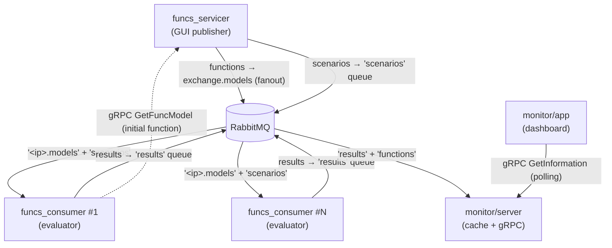
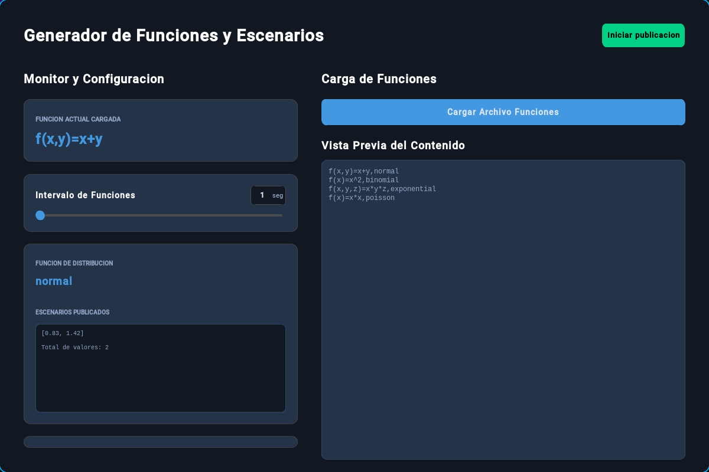
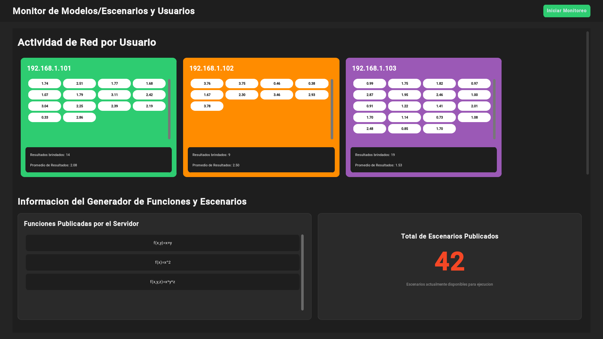

# Montecarlo-System

Distributed Monte Carlo simulation system. A server publishes mathematical functions and scenarios (random samples) through RabbitMQ; multiple clients consume that data, evaluate the function with the received scenario and publish the results. A central monitor aggregates the results per user and visualizes them in real time.

## Architecture



Each process does one job:

| Component | Job | Interface |
|---|---|---|
| `funcs_servicer/` | Publish the current function and generate random scenarios for it | GUI; produces to RabbitMQ; serves `FunctionService` over gRPC |
| `funcs_consumer/` | Evaluate `f(scenario)` and report the result | Headless; consumes/produces RabbitMQ; calls `FunctionService` once at startup |
| `monitor/server/` | Aggregate results and functions; count pending scenarios | Headless; consumes RabbitMQ; serves `InformationService` over gRPC; persists to CSV |
| `monitor/app/` | Visualize the aggregated state | GUI; polls `InformationService` every second |
| `monitor/shared_lib/` | Compiled `InformationService` protos shared by server and app | Editable dependency (`uv` workspace source) |

## Screenshots

**Function and scenario generator (`funcs_servicer`)** — functions file loaded, publishing scenarios:



**Monitoring dashboard (`monitor/app`)** — per-user results, published functions and scenario totals:



`funcs_consumer` and `monitor/server` are headless console programs.

## Messaging contracts

Everything on the wire is JSON. One exchange, four kinds of queues:

| Name | Kind | Durable | Producer → Consumer | Payload |
|---|---|---|---|---|
| `exchange.models` | fanout exchange | yes | servicer → every bound queue | `"f(x,y)=x+y"` (JSON string) |
| `<client-ip>.models` | queue, `x-max-length: 1` | no | fanout → one consumer | same as above |
| `scenarios` | queue | no | servicer → consumers (competing) | `[0.83, 1.42]` (JSON array, one value per function variable) |
| `results` | queue | yes | consumers → monitor/server | `{"user": "192.168.1.101", "result": 2.25}` |
| `functions` | queue | yes | fanout → monitor/server | same payload as `exchange.models` |

Design decisions behind those choices:

- **Fanout for functions**: every consumer must know the current function, so functions are broadcast. Each consumer binds its own queue, named after its IP.
- **`x-max-length: 1` on model queues**: only the *latest* function matters. If a consumer was offline during several publications, RabbitMQ keeps just the newest one.
- **Competing consumers for scenarios**: scenarios are work items, not state. A single queue with `prefetch_count=1` (fair dispatch) means each scenario is evaluated exactly once, by whichever client is free.
- **Purge on new function**: when the servicer publishes a new function it purges `scenarios`, because pending scenarios were sampled for the *previous* function's variable count and would no longer match.
- **Durability follows the data's value**: `results` are the product of the whole system, so the queue is durable and messages persistent (`delivery_mode=2`). Scenarios are cheap to regenerate, so both queue and messages are transient.

## gRPC services

Two small request/response services, both taking `google.protobuf.Empty`:

- **`FunctionService.GetFuncModel`** (served by `funcs_servicer`, protos in each project's `src/protos/`): returns `{function: string}` — the function currently in effect. Consumers call it once at startup so they don't have to wait for the next fanout publication.
- **`InformationService.GetInformation`** (served by `monitor/server`, protos in `monitor/shared_lib/`): returns the full monitor state in one shot:

  ```protobuf
  message GetInformationResponse {
    map<string, ResultList> user_results = 1;  // ip -> list of doubles
    repeated string published_functions = 2;
    int32 total_scenarios = 3;                 // messages currently in the 'scenarios' queue
  }
  ```

  The dashboard polls this once per second; the server counts scenarios with a passive `queue_declare` (no side effects).

## Persistence

`monitor/server` keeps its state in memory and writes it to `monitor/server/database/results.csv` on shutdown (`Ctrl+C`), reloading it on the next start. The format is one row per user plus one special row:

```csv
"192.168.1.101","2.25","0.83","1.42"
"functions","f(x,y)=x+y","f(x)=x^2"
```

Corrupt rows are skipped on load; an unreadable file falls back to an empty state.

## The evaluator

`funcs_consumer` never calls `eval()`. Incoming functions are:

1. **Parsed** with a regex (`str_function_parser.py`): `f(x,y)=x+y` → variables `[x, y]` + expression `x+y`.
2. **Compiled** to a Python `ast` tree and **walked** with an allowlist (`function_executer.py`): only `+ - * / % ^` (mapped to `**`) and unary minus over names and numeric constants. Any other node type is rejected, so a malicious "function" cannot execute code.
3. **Evaluated** with the scenario values bound to the variables, in order. A scenario whose length doesn't match the variable count is discarded.

## Requirements

- Python >= 3.14 and [uv](https://docs.astral.sh/uv/)
- A reachable RabbitMQ broker, e.g.:

  ```bash
  docker run -d -p 5672:5672 -p 15672:15672 rabbitmq:4-management
  ```

## Configuration

Each component reads its own `.env` (see the `.env.example` in each folder):

| Variable | Used by | Description |
|---|---|---|
| `RABBIT_HOST` | servicer, consumer, monitor/server | RabbitMQ broker host |
| `RABBIT_USER` / `RABBIT_PWD` | servicer, consumer, monitor/server | RabbitMQ credentials |
| `SERVER_HOST` / `SERVER_PORT` | servicer and consumer | Address of the servicer's `FunctionService` gRPC endpoint |
| `SERVER_HOST` / `SERVER_PORT` | monitor/server and monitor/app | Address of the monitor's `InformationService` gRPC endpoint |

> Note: `SERVER_HOST`/`SERVER_PORT` point to different services depending on the component pair; use different ports if you run everything on the same machine.

## Running

Start the broker first, then each component from its own folder (any order works — every component reconnects on its own schedule, but this order avoids startup noise):

```bash
# 1. Function and scenario generator (GUI)
cd funcs_servicer
uv run python -m src.App

# 2. Monitoring server (cache/aggregator)
cd monitor/server
uv run python -m src.main

# 3. One or more evaluator clients
cd funcs_consumer
uv run python -m src.main

# 4. Monitoring dashboard (GUI)
cd monitor/app
uv run python -m src.App
```

In the servicer: load a functions file, adjust the publication intervals with the sliders, and press *Iniciar publicacion*. In the dashboard: press *Iniciar Monitoreo*.

## Functions file format

One function per line: `expression,distribution` (the distribution goes after the last comma).

```
f(x,y)=x+y,normal
f(x)=x^2,binomial
f(x,y,z)=x*y*z,exponential
```

- Variables: the ones declared inside the parentheses; each published scenario carries one sampled value per variable.
- Operators supported by the evaluator: `+ - * / % ^` (power) and unary negation.
- Distributions (numpy, with fixed default parameters): `normal`, `binomial`, `poisson`, `uniform`, `exponential`, `gamma`, `beta`, `geometric`, `lognormal`. An unknown distribution is reported in the servicer UI and no scenario is generated.

The servicer cycles through the file's functions round-robin, one per *Intervalo de Funciones* tick, and generates a scenario for the current function every *Intervalo de Generacion* tick.
